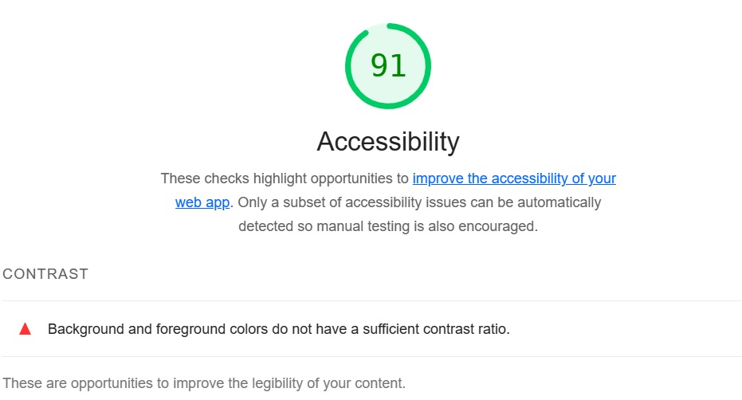

# Code-201-Lab-01-Demo

### Problem Domain

Create a webpage that accepts user input and, based on that input, displays messages back to the user.

### Instructions

Set up the HTML document <body> with <header>, <main>, and <footer> elements.

1. In the <main> of the file, place a <h1> tag with the content “Class 1 Lab”.

```
<h1>Class 1 Lab</h1>
```

2. Style this element with text and background colors via an internal <style> element placed in the <head> of your document.

```
    <style>
      h1 {
        font-family: cursive;
        color: pink;
        background-color: blueviolet;
        border: 3px solid pink;
        text-align: center;
        text-decoration-line: underline;
        padding: 20px;
      }
    </style>
```

3. In the HTML portion of the file, place the four questions within a series of <p> tags so that they are listed on the screen.

Give each <p> tag a different text color and background color by using inline styling.

```
<p style="color: red; background-color: beige" script="function">
        What is your favourite size adjective? (e.g. huge, big, large, tiny,
        enormous, little, tall, long, gigantic)
      </p>

      <p style="color: orange; background-color: beige">
        What is your favourite shape adjective? (e.g. flat, round, square,
        triangular, rectangular etc)
      </p>

      <p style="color: green; background-color: beige">
        What is your favourite colour? (e.g. blorange, red, orange, yellow,
        green, blue etc)
      </p>

      <p style="color: blue; background-color: beige">
        What is your favourite amphibian? (e.g. frog, newt, toad)
      </p>
```

4.  - Using a total of four JavaScript ‘prompt’ statements along the lines of our class demo, have a user answer four questions.

    - The user’s response to each question (input) should be stored in a separate variable. Name your variables carefully and let to define your variables.

    - Using these responses, return an alert to the user (output) that concatenates their response into some kind of reply like we did in class.

    - Strive to have your alert for each question utilize the responses to all of the prior questions such that by the fourth question, your response would look something like, “Greetings, Iggy from Ipanema, I also like to eat bananas while on vacation in Paris.”

    - Be creative and have fun with your questions/responses! They can be whatever you want so long as the input/output requirements are met.

    - In addition, for each response, create a console.log() message that indicates the nature of the question and the user’s response, as we did in class.

```
<script>
        let FaveSize = prompt(
          "What is your favourite size adjective? e.g. huge, big, large, tiny, enormous, little, tall, long, gigantic"
        );
        console.log("Our visitors favourite size adjective is " + FaveSize);
        console.log(typeof name);

        let FaveShape = prompt(
          "What is your favourite shape adjective? e.g. flat, round, square, triangular, rectangular"
        );
        console.log("Our visitors favourite shape adjective is " + FaveShape);
        console.log(typeof name);

        let FaveColour = prompt(
          "What is your favourite colour adjective? e.g. blorange, red, orange, yellow, green, blue"
        );
        console.log("Our visitors favourite colour adjective is " + FaveColour);
        console.log(typeof name);

        let FaveAmphibian = prompt(
          "What is your favourite amphibian? e.g. frog, toad, newt, axolotl"
        );
        console.log(
          "Our visitors favourite colour adjective is " + FaveAmphibian
        );
        console.log(typeof name);

        alert(
          "Oh my god, that's so weird. I collect " +
            FaveSize +
            ", " +
            FaveShape +
            ", " +
            FaveColour +
            " " +
            FaveAmphibian +
            "s!"
        );
      </script>
```

5.  - Using Lighthouse in the Chrome DevTools, analyze the accessibility of your application.

    - The following options to generate a Lighthouse report should be selected
      - Mode: Navigation
      - Device: Desktop
      - Categories: Accessibility
      - A score between 50-65 is a great place to start for this first lab.



### Resources

Refer to the code demo from today as a starting point for this lab assignment.

### Submission Instructions

- Go to https://gist.github.com.
- In the “Gist description…” field, put your name.
- In the “Filename including extension…” field put ‘index.html’.
- Copy-paste your code into the big input field for the Gist.
- Select the button that says “Create secret gist”.
- Choose the “Share” option in the drop down list next to the link.
- Copy the link from the Gist screen for submission in the URL field below.
